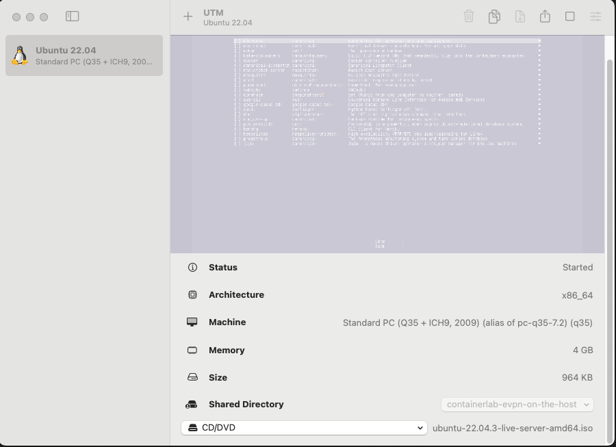

# Containerlab EVPN on the host

We use Ubuntu 22.04.03 LTS **Server** as our image for the guide.

It can be downloaded [here](https://releases.ubuntu.com/jammy/)

Please install the machine.

Clone this repository locally to your machine.

Destination could be something like `$HOME/git/containerlab-evpn-on-the-host`.

Internet should work on your VM/Machine without a proxy.

## Windows
not supported as I don't have a device to verify it.
I think HyperV or VirtualBox could be used to setup an Ubuntu Server 22.04.03 VM as mentioned above.

## MacOS

Install [UTM](https://docs.getutm.app/installation/macos/).

Setup the VM with the following settings.



## Install Ubuntu in your VM.

1. Choose the standard installation.
2. Use the default settings everywhere.
3. Use the curated package suite.
4. Use the full disk and do not encrypt it.
5. **username**: tester
6. **password**: tester
7. **hostname**: server

I you have a VM enable password authentication for ssh to allow to connect to it from your host system via ssh.

```ssh-config
PasswordAuthentication=yes
MaxAuthTries 15 # if you have a lot of ssh-keys.
```

Additionally you could also mount the shared folder into your VM

```bash
mkdir -p $HOME/git/containerlab-evpn-on-the-host
sudo mount -t 9p -o trans=virtio share $HOME/git/containerlab-evpn-on-the-host -oversion=9p2000.L
```

Or clone this repository:

```bash
git clone https://github.com/Cellebyte/denog-evpn-to-the-host.git
```

## Install requirements for our lab

### Arch/Manjaro

```bash
yay -S containerlab-bin podman python-poetry
```

Please follow the podman guide in the [ArchLinux wiki](https://wiki.archlinux.org/title/Podman).

### Others

**IDK**

### Ubuntu/Debian

```bash
## adds containerlab repository
echo "deb [trusted=yes] https://apt.fury.io/netdevops/ /" | \
sudo tee -a /etc/apt/sources.list.d/netdevops.list

## adds podman repository
echo 'deb http://download.opensuse.org/repositories/devel:/kubic:/libcontainers:/unstable/xUbuntu_22.04/ /' | sudo tee /etc/apt/sources.list.d/devel:kubic:libcontainers:unstable.list
curl -fsSL https://download.opensuse.org/repositories/devel:kubic:libcontainers:unstable/xUbuntu_22.04/Release.key | gpg --dearmor | sudo tee /etc/apt/trusted.gpg.d/devel_kubic_libcontainers_unstable.gpg > /dev/null

sudo apt update && sudo apt install containerlab podman curl

curl -sSL https://install.python-poetry.org | python3 -

systemctl start podman.socket

## if you get an masked service error

systemctl unmask podman.service
systemctl unmask podman.socket
systemctl start podman.socket
```

additional installation methods can be found here ->
* ref: [ContainerLab Package Managers](https://containerlab.dev/install/#package-managers)

## Setup of the LAB

### General Description
Now that you have a VM or local running `podman` and `containerlab` cli available we can start with the building of some containers.

Every manual which is written in this guide assumes that you are in the root of this git project.

### Injector container

We need a container which injects some training routes into our network fabric.

```bash
cd containerlab/containers/gobgp
podman build -t cellebyte.de/gobgp-fabric:latest .
# this copies the image from our local user to the root user.
podman image scp tester@localhost::cellebyte.de/gobgp-fabric:latest
```

### Host container

```bash
cd containerlab/containers/netplanner-frr
podman build -t cellebyte.de/netplanner-frr-fabric:latest .
# this copies the image from our local user to the root user.
podman image scp tester@localhost::cellebyte.de/netplanner-frr-fabric:latest
```

### Getting a full-table from RIPE

```bash
# install dependencies
poetry install --no-root
# instantiate a shell with all 
poetry shell
# generate our sample routes for the environment
python scripts/route-dicer.py
```

### Instantiating the lab.

```bash
cd containerlab
sudo containerlab deploy --reconfigure -t containerlab.yaml
```


## The LAB

### General information

#### LoopBack Networks
* Switches: 192.168.0.0/24
* Servers: 192.168.255.0/24

#### Node Overlay Network (e.g):
* IPv4: 10.255.255.0/24
* IPv6: fc00::/64

#### Peering Networks
* fc80::/9
* 192.168.100.0-192.168.254.0
* {vlan} calculated counting upwards from 100 by the vrf keys in `routes/ipv4.json` and `routes/ipv6.json`
  * 192.168.{vlan}.1/30 <-> 192.168.{vlan}.2/30
  * fc80:cafe:{vlan}::1/126 <-> fc80:cafe:{vlan}::2/126


#### Routes per VRF
* VRF mgmt 
  * IPv4: 10.0.0.0/16
  * IPv6: fc00::/8
* VRF internet (we will use a full-table)
  * IPv4: 0.0.0.0/0
  * IPv6: ::/0
